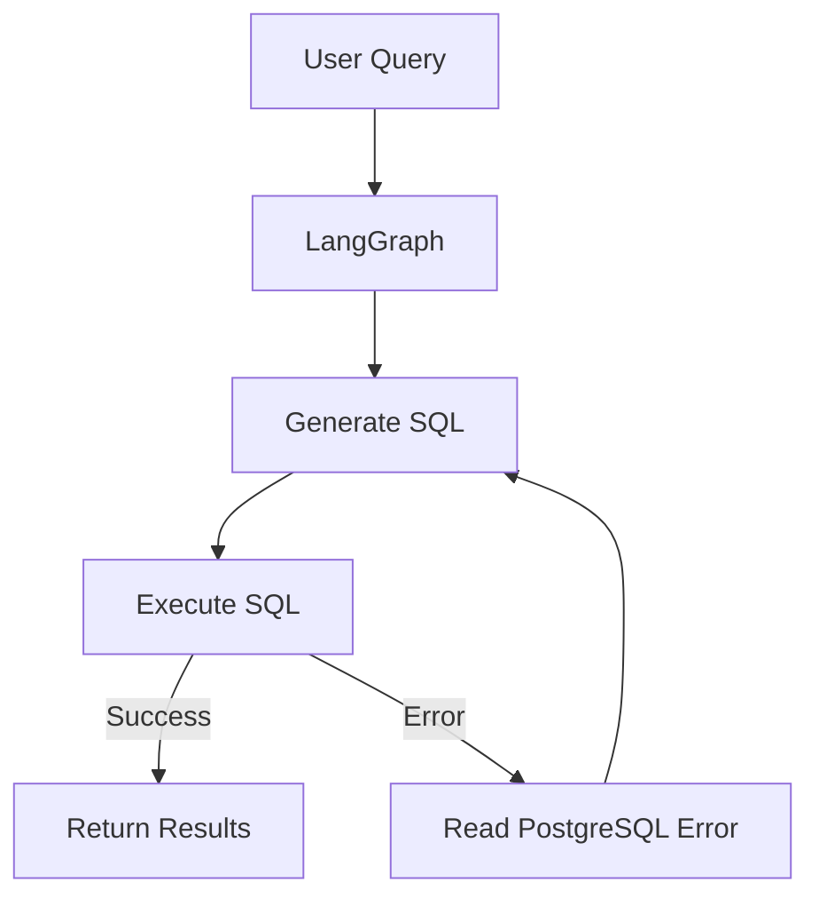

# 🧠 NL-Database Analyst

[](https://fastapi.tiangolo.com/)
[](https://reactjs.org/)
[](https://www.postgresql.org/)
[]()
[](https://langchain.com/)
[]()
[]()
[]()

Autonomous AI agent that converts **Natural Language → SQL**, executes queries on **PostgreSQL**, detects execution failures, and **self-heals** by regenerating SQL using **LangGraph** and **Llama-3.3-70B**.

---

## 📸 Demo


---

# ✨ Features

- 🤖 Natural Language → SQL
- 🔄 Autonomous SQL self-healing
- 🧠 LangGraph state machine
- 🗄️ Schema-aware query generation
- ⚡ FastAPI async backend
- 📊 LangSmith observability
- 🐘 PostgreSQL integration
- ⚛️ React + Vite frontend
- 🐳 Dockerized deployment
- ☁️ AWS EKS ready

---

# 🏗️ Architecture



---

# ⚙️ Tech Stack

| Category | Technologies |
|----------|--------------|
| AI | LangGraph, LangChain, Groq, Llama-3.3-70B |
| Backend | FastAPI, Python, asyncpg |
| Frontend | React, Vite, TailwindCSS |
| Database | PostgreSQL |
| DevOps | Docker, Docker Compose |
| Cloud | AWS EKS, Amazon ECR |
| Monitoring | LangSmith |

---

# 🚀 Local Setup

### Clone

```bash
git clone <repository-url>

cd nl-database-analyst
```

### Configure

Create a `.env`

```env
GROQ_API_KEY=

DATABASE_URL=

LANGCHAIN_TRACING_V2=true

LANGCHAIN_API_KEY=

LANGCHAIN_PROJECT=nl_db_analyst
```

### Run

```bash
docker compose up -d
```

---

# 🌐 Endpoints

| Service | URL |
|---------|-----|
| Frontend | http://localhost |
| API Docs | http://localhost:8000/docs |

---

# ☁️ AWS Deployment

Production deployment targets **Amazon Elastic Kubernetes Service (EKS)**.

### Workflow

- Build Docker images
- Push images to Amazon ECR
- Provision EKS cluster
- Create Kubernetes Secrets
- Deploy PostgreSQL
- Deploy FastAPI backend
- Deploy React frontend
- Expose frontend with AWS Load Balancer

---

### Kubernetes Components

- 🔐 Secrets
- 🗄️ PostgreSQL Deployment
- ⚙️ Backend Deployment
- 💻 Frontend Deployment
- 🌐 Services & Load Balancer

---

### Cloud Architecture

```text
                Internet
                    │
                    ▼
        AWS Load Balancer (NLB)
                    │
                    ▼
          React Frontend Pods
                    │
                    ▼
         FastAPI Backend Pods
                    │
          LangGraph Workflow
                    │
                    ▼
          PostgreSQL Database
```

---

# 📈 Highlights

- Autonomous retry loop
- Self-healing SQL generation
- Schema-aware prompting
- Production-ready architecture
- Stateless backend
- Horizontal scaling
- Cloud-native deployment
- Observability with LangSmith

---

# 🔮 Roadmap

- Multi-database support
- Query explanation
- Dashboard generation
- SQL optimization
- Authentication
- Saved queries
- Streaming responses

---

# 📄 License

MIT License.

---

⭐ If you found this project useful, consider starring the repository.
````
