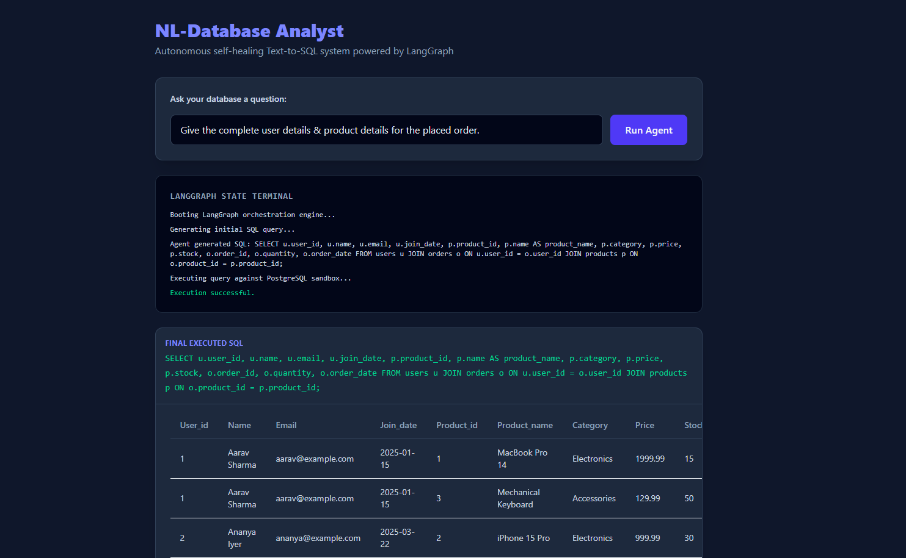
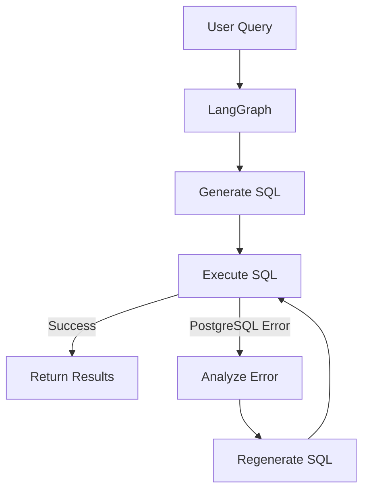

<h1 align="center">🧠 NL-Database Analyst</h1>

<p align="center">
  Autonomous AI agent that converts <strong>Natural Language → SQL</strong>, executes queries on <strong>PostgreSQL</strong>, and autonomously repairs failed queries using <strong>LangGraph</strong> and <strong>Llama-3.3-70B</strong>.
</p>

<p align="center">
  <a href="https://fastapi.tiangolo.com/">
    
  </a>

  <a href="https://react.dev/">
    
  </a>

  <a href="https://www.postgresql.org/">
    
  </a>

  <a href="https://langchain-ai.github.io/langgraph/">
    
  </a>

  <a href="https://www.langchain.com/">
    
  </a>

  <a href="https://groq.com/">
    
  </a>

  <a href="https://www.docker.com/">
    
  </a>

  <a href="https://aws.amazon.com/eks/">
    
  </a>
</p>

---

## 📸 Demo

<p align="center">
  
</p>

---

## ✨ Features

- 🤖 Natural Language → SQL
- 🔄 Autonomous SQL Self-Healing
- 🧠 LangGraph Agent Workflow
- 🗄️ Schema-Aware Query Generation
- ⚡ FastAPI Async Backend
- 📊 LangSmith Observability
- 🐘 PostgreSQL Integration
- ⚛️ React + Vite Frontend
- 🐳 Dockerized Deployment
- ☁️ AWS EKS Ready

---

## 🏗️ Architecture



---

## ⚙️ Tech Stack

| Category | Technologies |
|-----------|--------------|
| AI | LangGraph, LangChain, Groq, Llama-3.3-70B |
| Backend | FastAPI, Python, asyncpg |
| Frontend | React, Vite, TailwindCSS |
| Database | PostgreSQL |
| DevOps | Docker, Docker Compose |
| Cloud | AWS EKS, Amazon ECR |
| Monitoring | LangSmith |

---

## 🚀 Local Setup

### Clone

```bash
git clone <repository-url>

cd nl-database-analyst
```

### Configure

Create a `.env` file.

```env
GROQ_API_KEY=

DATABASE_URL=

LANGCHAIN_TRACING_V2=true

LANGCHAIN_API_KEY=

LANGCHAIN_PROJECT=nl_db_analyst
```

### Run

```bash
docker compose up -d
```

---

## 🌐 Endpoints

| Service | URL |
|----------|-----|
| Frontend | http://localhost |
| FastAPI Docs | http://localhost:8000/docs |

---

## ☁️ AWS Deployment

Deploy to **Amazon Elastic Kubernetes Service (EKS)**.

### Deployment Flow

- Build Docker Images
- Push Images to Amazon ECR
- Provision EKS Cluster
- Configure Kubernetes Secrets
- Deploy PostgreSQL
- Deploy FastAPI Backend
- Deploy React Frontend
- Expose with AWS Load Balancer

---

### Cloud Architecture

```text
                 Internet
                     │
                     ▼
      AWS Network Load Balancer
                     │
                     ▼
         React Frontend Pods
                     │
                     ▼
        FastAPI Backend Pods
                     │
          LangGraph Workflow
                     │
                     ▼
         PostgreSQL Database
```

---

## 📈 Highlights

- Autonomous Retry Loop
- Self-Healing SQL
- Schema-Aware Prompting
- Production-Ready
- Horizontal Scaling
- Cloud Native
- LangSmith Observability

---

## 🔮 Roadmap

- Multi-Database Support
- Query Explanation
- SQL Optimization
- Dashboard Generation
- Authentication
- Saved Queries
- Streaming Responses

---

## 📄 License

MIT License.

---

<div align="center">

⭐ **If you found this project useful, consider giving it a star!**

</div>

